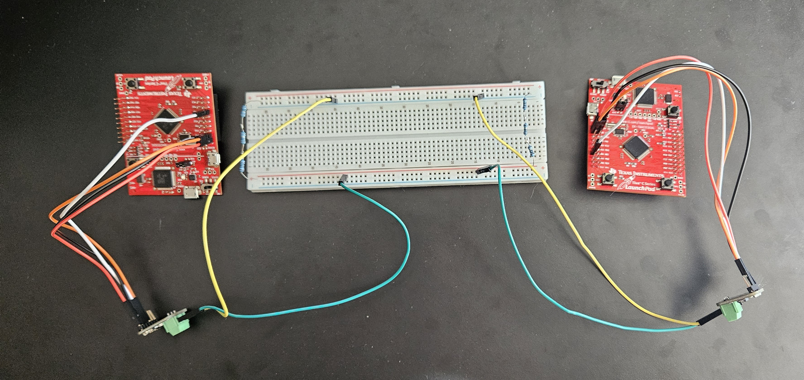

# Introduction

This is the home to the joint development of controller area network (CAN) drivers for the Texas Instruments EK-TM4C123GXL micro-controller, and an OBD2 interface.

## Controller Area Network Drivers

A software interface to utilize the CAN module on the MCU. I intend this interface to strike a balance between ease of use while providing adequate configuration options.

Supported CAN features are:

- Data frames
- Remote frames
- Changing bit timings
- Detecting new data

## OBD2 Library

I plan to use the CAN drivers to create a library of OBD2 functions in order to extract data from a vehicles ECUs. 

The OBDII library will be open ended; not all vehicles support OBDII in the same way. For instance, some vehicles use 11 bit CAN IDs for correspondance while others use 29 bit. 

Abstracting the CAN layer means that a programmer developing a diagnostics application does not need to learn the underlying CAN message structure or CAN module interface. 

## Development Philosophy

The intention behind this project is to demonstrate a modular approach to software development. 

From bottom to top: Controller Area Network drivers interact with the CAN module and provide ample configuration without the user having to learn the memory-mapped hardware interface. 

A library developed for a higher level communication standard can use CAN drivers to develop an API to send and receive messages of a certain format. Since the driver level is generic, many different message formats can be developed for using the same underlying drivers. 

Finally, an application developer can design a program with the user in mind without worrying about the underlying message format. 

## Testing

Since testing involves two devices, the software that is flashed onto each MCU may be different. This complicates testing, as I am using the same project as the bases for both devices. 

Due to this constraint, either device will enter a dedicated testing procedure at the start of program execution. 

This constraint led me to develop test level defined interrupt functions. This way, interrupt handlers can remain generic, and call a function which is set inside a corresponding test function. 

